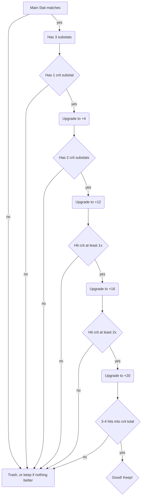
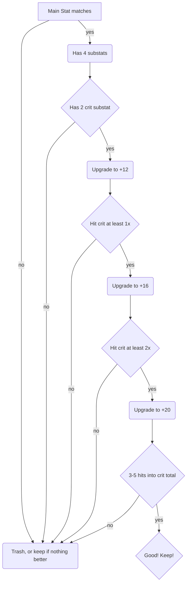

Upgrading Artifact Guide - for DPS
==================================

I learned this method from fobm4ster, and think it's been fairly effective in helping decide what artifacts are/aren't worth upgrading further.

The general idea is to get at least 3 hits into crit by +20, if possible. And if it's not possible at +12/+16, then it's not worth upgrading.

Table of Contents
=================

  * [3 Substats Scenario](#3-substats-scenario)
  * [4 Substats Scenario](#4-substats-scenario)

3 Substats Scenario
-------------------

4 Substats Scenario
--------------------

